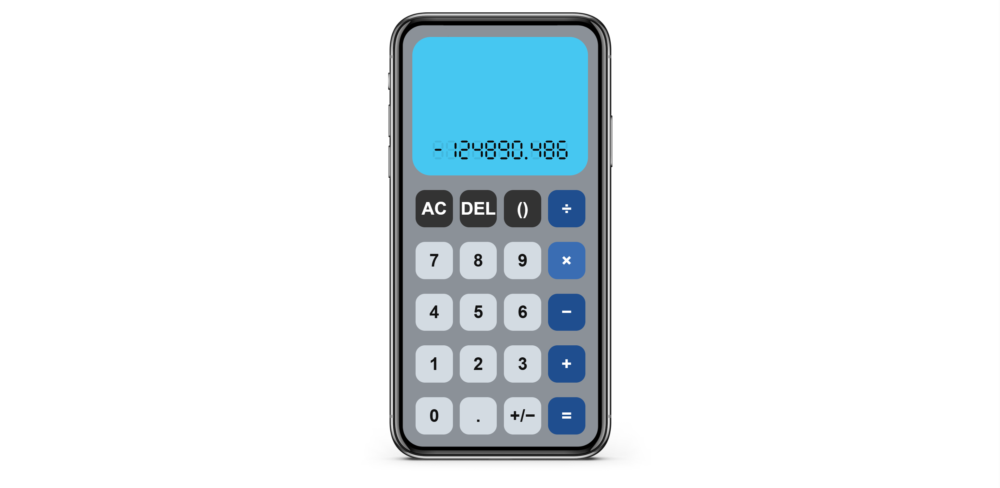

# 🆉 Simple Calculator (Prototype #1 on Frontend ver. 1)

## Features (Compared to Prototype #1)

For functionalities, there is no difference from Prototype #1...

> ##### Then, what have you done?

Do not be rush, what I have done is that I tried to implement *Prototype #1* **into a frontend framework** for deploying (or in easier word, *"publishing"*) to the public.

> ##### That does not sound hard...

But something ***special*** is that I chose a framework that is technically **not runnable on Windows**, so I tried **WSL** to give it a Linux environment, and I succeeded eventually!

## Installation...

Since the installation of this branch ***may be*** **too** hard for people who never learn CS courses, but ***may be*** **so** easy for "computer scientists" from universities. So, I will not  write the *such-a-long* instruction. 

> ##### Again?! Do not look down on us, we are clever enough!

Oh, really? Okay, since I am too tired on writing *such-a-long* instruction, but you want to hear more from me. Let me expose **a few hints** for you to dig up and accomplish yourselves then:

**Hint 1**: Since I mentioned "[WSL](https://learn.microsoft.com/en-us/windows/wsl/install)" previously, if you are using Windows, ***can you try to install it on your own computer?***
**Hint 2**: Finishing installing "[WSL](https://learn.microsoft.com/en-us/windows/wsl/install)" ***does not mean you have a Linux OS***, you have to download one like "[Ubuntu](https://apps.microsoft.com/detail/9pdxgncfsczv?hl=en-US&gl=CA)".
**Hint 3**: The frontend framework I chose is "[Ignite](https://github.com/twostraws/Ignite)", can you figure out how to ***install it, build an "[Ignite](https://github.com/twostraws/Ignite)" project, and run it locally using "[WSL](https://learn.microsoft.com/en-us/windows/wsl/install)"?***

## "Stories" Behind the Work

This is the **first time** I tried to build a frontend app myself from scratch, but surprisingly, it is not that hard to implement a frontend once you have your source codes ready.

##### And it is also the first time I tried to build a frontend app myself using WSL to run something that is not compatible to Windows.

###### Now, I just wish if I can traverse back to when I took the "HCI design" course, and hand this product in instead of what I had previously, possibly I can get a 100% in that assignment instead...

> ##### Stop daydreaming!

Okay...

## Screenshots

