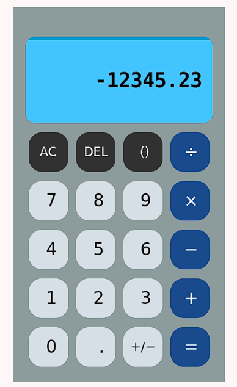

# 🆉 Simple Calculator (Prototype #2)

## Features (Compared to Final Version)

###### This one is also very close to the final version, except: 

1. Does not have header and footer.
2. Cannot change the background colour.
3. Some keyboard input has reassigned due to functionality issues.

###### Other than that, it is even more enjoyable compared to the Prototype #1 in my own opinion due to my hard working. 

## Installation

###### Since this prototype is kind of hard and tedious to implement on your computer if you follow the same method as previous *branches*. Please follow the guideline I wrote in "Releases" to test and play with this prototype.

## "Stories" Behind the Work

This prototype version takes me the most effort to accomplish.

###### Overall, I am done trying unpopular programming languages/methods for Windows. This is probably the first and last trial I write a GUI app using Swift on Windows.
## Screenshots

