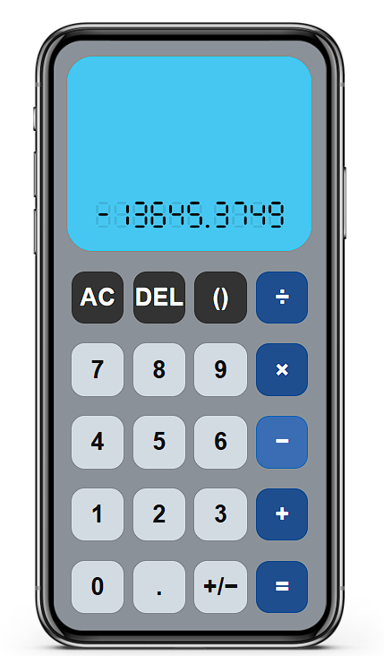

# 🆉 Simple Calculator (Prototype #1)

## Features (Compared to Final Version)

###### This one is very close to the final version, except: 

1. Does not have header and footer.
2. Cannot change the background colour.

###### Other than that, it is much more enjoyable compared to the demos. 

## Installation

###### This time, I decide to not give you the full steps of installation. Can you figure out yourself?

> ##### Come on...

## "Stories" Behind the Work

This prototype version takes me the second largest effort to accomplish.

###### You can probably guess out which one takes the most effort...

###### Clearly, I think I did a much great job on the prototype compared to what I did in the demos, which are parts of the assignments in my university course.

## Screenshots

