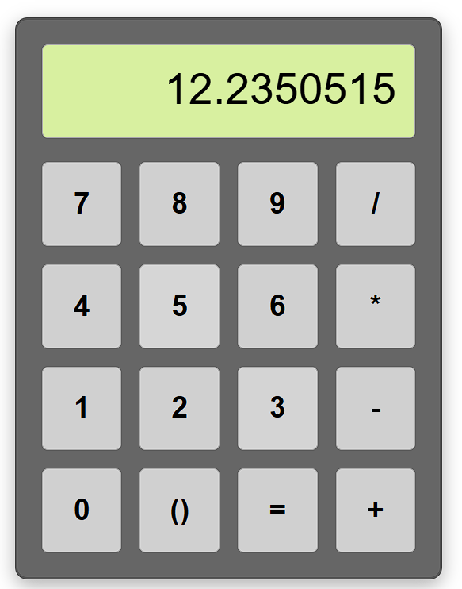

# 🆉 Simple Calculator (Demo #2)

## Features (Compared to Demo #1)

###### This one is still simple, but a *little* better compared to Demo #1: 

1. Add bracket button.

###### (That is it... A ***little*** better...)

## Installation

###### See that is why I need to create this section, I need to tell you how to download and run it natively on your computer!

###### (Very similar installation guide to Demo 1.)

1. Download the zip folder:
```
<> Code → Download ZIP
```
2. Unzip the zip folder on your computer
```
*Right click* → Extract All...
```
3. Go into the extracted folder, find "index.xhtml".
4. Double-click it to open the calculator on your browser.
5. Enjoy! (Probably still not enjoyable compared to my final version...)

## Stories Behind the Work

This is actually another part of the assignment from one of my university courses —— HCI Design.

That course is teaching us how to design a software that makes user enjoyable by interacting with it.

> ##### Wait! We have saw these sentences already!

Yeah, I know. I prefer to repeat them for those who accidentally skip my notes for Demo #1, who directly come to **here**.

###### Clearly, I do not think I did a great job on that assignment, that is how it pushed me to build towards the final version.

## Screenshots


