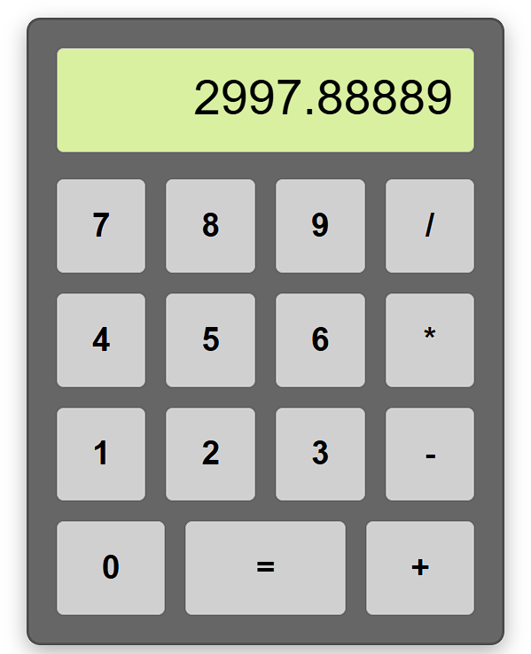

# 🆉 Simple Calculator (Demo #1)

## Features (Compared to Final Version)

###### This one is too simple compared to what I have finally: 

1. Only have numbers and basic operations.
2. Cannot delete or clear the digits.
3. Nothing happen when you click "=" consecutively.
4. Lack of lots of interactions like keyboard input and graphical transition.  

## Installation

###### See that is why I need to create this section, I need to tell you how to download and run it natively on your computer!

1. Download the zip folder:
```
<> Code → Download ZIP
```
2. Unzip the zip folder on your computer
```
*Right click* → Extract All...
```
3. Go into the extracted folder, find "index.xhtml".
4. Double-click it to open the calculator on your browser.
5. Enjoy! (Probably not that enjoyable compared to my final version...)

## Stories Behind the Work

This is actually part of the assignment from one of my university courses —— HCI Design.

That course is teaching us how to design a software that makes user enjoyable by interacting with it.

###### Clearly, I do not think I did a great job on that assignment, that is how it pushed me to build towards the final version.

## Screenshots


